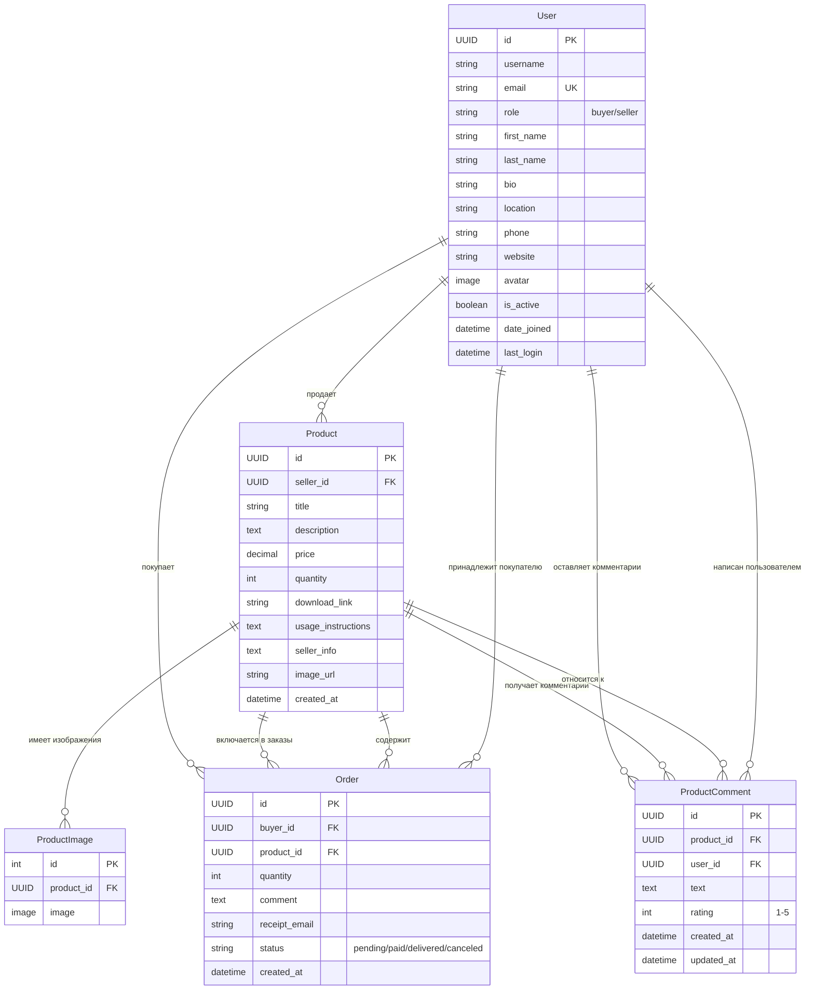

# Схема базы данных ReShop

## Обзор системы
ReShop - это цифровая торговая площадка, где пользователи могут покупать и продавать цифровые товары.

## Диаграмма базы данных

## Описание таблиц

### 1. User (Пользователь)
- **Основная таблица** для всех пользователей системы
- **Роли**: покупатель (buyer) или продавец (seller)
- **Профиль**: аватар, биография, местоположение, телефон, веб-сайт
- **Аутентификация**: email как основной идентификатор для входа

### 2. Product (Товар)
- **Цифровые товары** для продажи
- **Связь с продавцом** через Foreign Key
- **Метаданные**: название, описание, цена, количество
- **Цифровое содержимое**: ссылка для скачивания, инструкции по использованию
- **Информация от продавца** и изображения

### 3. ProductImage (Изображения товара)
- **Множественные изображения** для одного товара
- **Загрузка файлов** в папку products/

### 4. Order (Заказ)
- **Связь покупателя с товаром**
- **Статусы заказа**: ожидание оплаты, оплачен, доставлен, отменен
- **Дополнительная информация**: комментарий, email для чека

### 5. ProductComment (Комментарии к товару)
- **Отзывы и рейтинги** от пользователей
- **Рейтинг по шкале 1-5**
- **Временные метки** создания и обновления

## Ключевые особенности архитектуры

✅ **UUID первичные ключи** для безопасности и масштабируемости  
✅ **Гибкая система ролей** (покупатель/продавец)  
✅ **Поддержка множественных изображений** для товаров  
✅ **Система статусов заказов** для отслеживания  
✅ **Система комментариев и рейтингов** для товаров  
✅ **Расширенный профиль пользователя** с дополнительной информацией  

## Технологический стек

- **Backend**: Django (Python)
- **База данных**: SQLite (разработка) / PostgreSQL (продакшн)
- **Файловое хранилище**: Локальная файловая система
- **Frontend**: Vue.js с TypeScript
