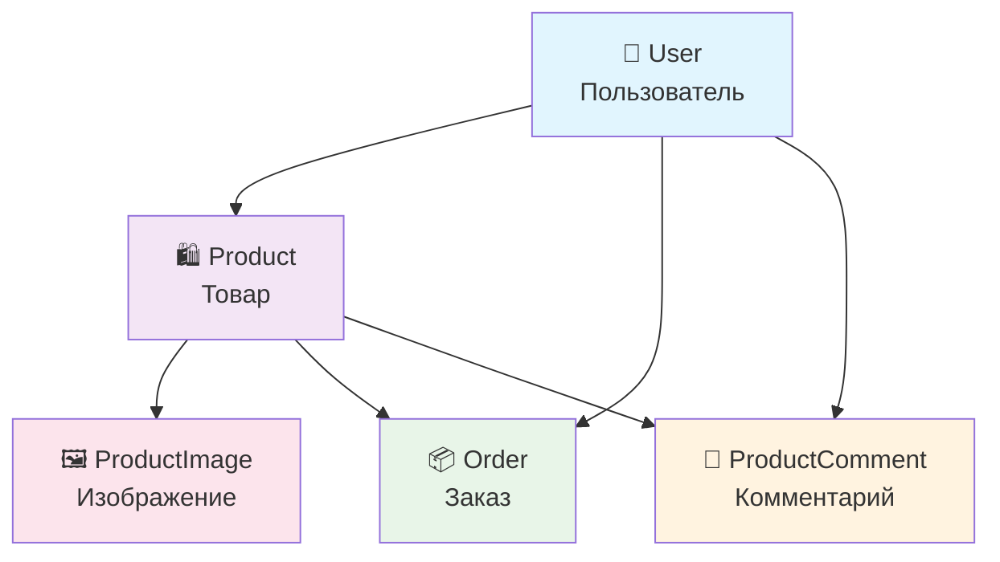

# Упрощенная схема базы данных ReShop

## Основные сущности

## Краткое описание

| Таблица | Назначение | Ключевые поля |
|---------|------------|---------------|
| **User** | Пользователи системы | id, email, role, avatar, bio |
| **Product** | Цифровые товары | id, title, price, seller_id |
| **Order** | Заказы покупателей | id, buyer_id, product_id, status |
| **ProductComment** | Отзывы и рейтинги | id, product_id, user_id, rating |
| **ProductImage** | Изображения товаров | id, product_id, image |

## Связи между таблицами

- **User** → **Product** (один ко многим) - продавец создает товары
- **User** → **Order** (один ко многим) - покупатель делает заказы  
- **Product** → **Order** (один ко многим) - товар входит в заказы
- **Product** → **ProductComment** (один ко многим) - товар получает отзывы
- **Product** → **ProductImage** (один ко многим) - товар имеет изображения

## Типы пользователей

- **👨‍💼 Продавец (seller)** - создает товары, получает заказы
- **👤 Покупатель (buyer)** - просматривает товары, делает заказы
- **🔄 Оба** - могут оставлять комментарии и рейтинги
